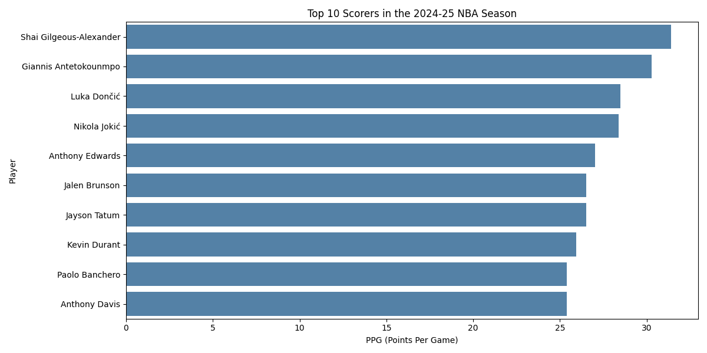
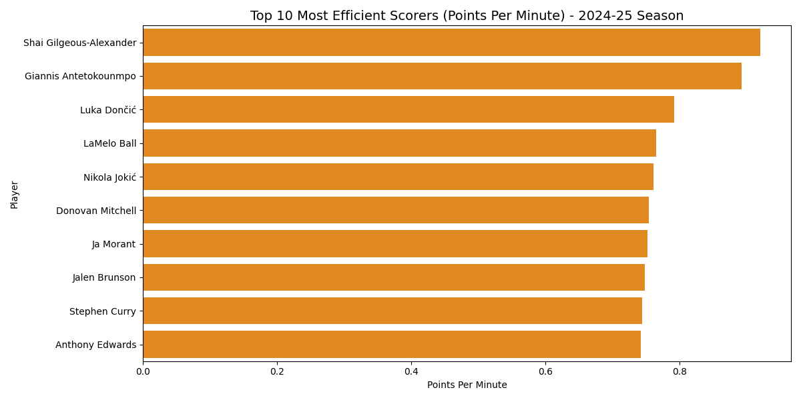
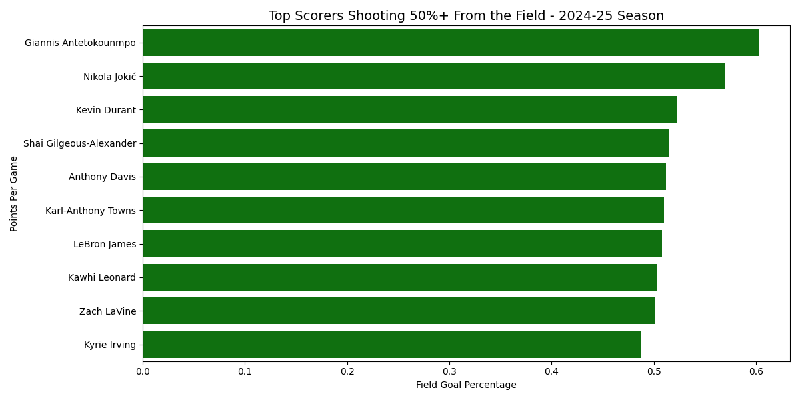
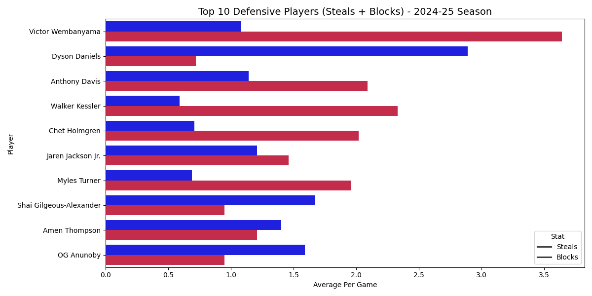

# NBA Stats Pipeline

I created an automated data pipeline that extracts live statistics for NBA players using the NBA API, then transforms and
then cleans the data using pandas, then loads it into the SQL database, and creates queries to answer questions.

# Tech Stack
Python
Pandas
SQLite
SQL
Matplotlib
Seaborn
Nba_api

# How It Works
- Pulls 30,000+ rows of NBA game log data from the 24-25 season using the API
- Cleans the data using pandas (renaming columns, dropping nulls, converting data types, and creating a point per mintue column)
- Loads the clean data in the SQL database
- Uses queries to answer my 4 analytical questions
- Creating charts to visualize the data

# Questions Being Answered
- Who are the top 10 scorers in the 2024-25 season?
- Who are the most efficient scorers by points per minute?
- Which high-volume scorers shoot over 50% from the field?
- Who are the most dominant defensive players by steals and blocks combined?

# Charts

# How To Run
1. Install dependencies: `pip install nba_api pandas matplotlib seaborn`
2. Run the pipeline: `python nba_pipeline.py`
